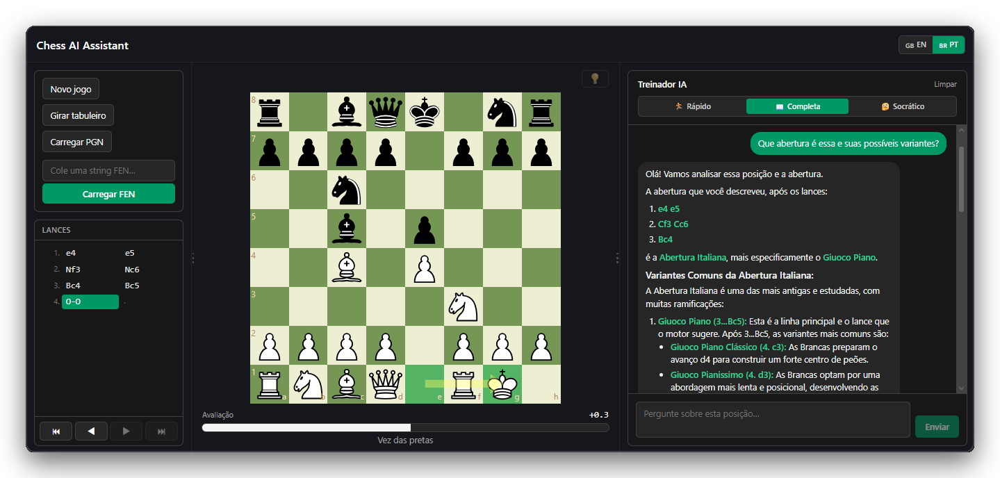

<div align="center">

# ♟️ Chess AI Assistant

**Ambiente de estudo de xadrez com um consultor de IA.**


</div>

Jogue e estude em um tabuleiro interativo, carregue partidas via PGN/FEN, receba
análise em tempo real do motor **Stockfish** e converse com um **LLM** que
explica lances, planos e ideias — com os lances recomendados desenhados como
setas no tabuleiro. Interface bilíngue (**pt-BR / en**).

<p align="center">
  
  <br>
  <sub><i>Interface do Chess AI Assistant — tabuleiro interativo, análise do Stockfish e o treinador IA com renderização em Markdown.</i></sub>
</p>

---

## ✨ Funcionalidades

- ♟️ Tabuleiro interativo com **arrastar** e **clicar-para-mover** (preview de lances legais)
- 👑 **Promoção de peão** com escolha entre Dama / Torre / Bispo / Cavalo
- 🧠 Análise automática em tempo real com **Stockfish** + barra de avaliação
- 💡 Botão para **mostrar/ocultar** a seta do melhor lance do motor
- 💬 **Chat com IA** (treinador) com 3 modos: 🏃 Rápido, 📖 Completa, 🤔 Socrático
- 📝 Respostas do chat renderizadas em **Markdown**
- 🔌 **Troca de provedor LLM por `.env`** (Groq, OpenAI, Anthropic, Gemini) — sem mudar código
- ⏮️ **Histórico navegável** (clique nos lances, setas ◀ ▶ e teclado ← →)
- 🖱️ **Painéis redimensionáveis** (arraste os divisores; as larguras persistem)
- 🌐 Interface **bilíngue** (pt-BR / en) com persistência da escolha

## 🧰 Stack

**Frontend:** React 19 + TypeScript (Vite), `react-chessboard` v5, `chess.js`,
i18next, Tailwind CSS v4, `react-markdown`.
**Backend:** Python (FastAPI assíncrono), biblioteca `stockfish`, `httpx`,
`pydantic`. Integração com LLM via **padrão Adapter** selecionado por `.env`.

## 📁 Estrutura

```
chess-IA/
├── frontend/        # React + TS + Tailwind + i18next
│   ├── src/
│   │   ├── components/   ChessBoard, ChatPanel, AnalysisBar, GameControls,
│   │   │                 LanguageSwitcher, MoveHistory, ModeSelector,
│   │   │                 PromotionDialog, ResizeDivider, Modal
│   │   ├── hooks/        useChessGame, useChat, useAnalysis,
│   │   │                 useSquareSize, usePanelResize
│   │   ├── services/     api.ts
│   │   ├── config/       layoutConfig.ts
│   │   └── i18n/         locales/en.json, locales/pt-BR.json
│   └── requirements.txt # referência (instale com: npm install)
├── backend/         # FastAPI
│   ├── app/
│   │   ├── main.py
│   │   ├── routers/      chat.py, analysis.py
│   │   ├── services/     stockfish_service.py, llm/ (adapters + factory)
│   │   └── models/       chat.py, analysis.py, common.py
│   └── requirements.txt
├── docs/            # documentação adicional
└── start-dev.cmd / start-dev.ps1   # sobem backend + frontend
```

## ✅ Pré-requisitos

- **Node.js** 18+ e npm
- **Python** 3.10+ (3.11+ recomendado)
- Binário do **Stockfish**

### Instalar o Stockfish
- **Windows:** baixe em <https://stockfishchess.org/download/>, descompacte e
  aponte `STOCKFISH_PATH` para o `.exe`.
- **Ubuntu/Debian:** `sudo apt install stockfish`
- **macOS:** `brew install stockfish`

## 🚀 Instalação

**1. Backend**
```bash
cd backend
python -m venv .venv
# Windows:  .venv\Scripts\Activate.ps1
# Unix:     source .venv/bin/activate
pip install -r requirements.txt

copy .env.example .env   # Windows  (Unix: cp .env.example .env)
```
Edite `backend/.env`: defina `LLM_PROVIDER` + a chave correspondente e
`STOCKFISH_PATH`.

**2. Frontend**
```bash
cd frontend
npm install
```

## ▶️ Como rodar

**Opção A — script (Windows):** dê duplo-clique em **`start-dev.cmd`** (sobe
backend na 8000 e frontend na 5173 em janelas separadas).

**Opção B — manual (dois terminais):**
```bash
# Terminal 1 (backend)
cd backend && uvicorn app.main:app --reload --port 8000
# Terminal 2 (frontend)
cd frontend && npm run dev
```
Abra <http://localhost:5173>. O Vite faz proxy de `/api` para o backend.

## ⚙️ Variáveis de ambiente

Veja [`backend/.env.example`](backend/.env.example). Principais:
`LLM_PROVIDER` (`groq` | `openai` | `anthropic` | `gemini`) + a chave
correspondente; overrides de modelo (ex.: `GEMINI_MODEL=gemini-2.5-flash`);
`STOCKFISH_PATH`, `STOCKFISH_DEFAULT_DEPTH`; `BACKEND_PORT`, `FRONTEND_URL`.

## 📚 Documentação adicional

- [docs/contexto-e-memoria-do-chat.md](docs/contexto-e-memoria-do-chat.md) — como
  o chat lida com contexto e memória.
